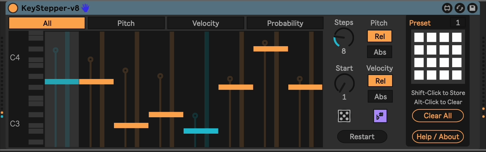

# m4l-KeyStepper

## A manually-advanced variable-length step sequencer.

This is a Max For Live step sequencer that advances on note-on events and supports loop lengths of 1 to 32 steps. This gives you the ability to easily create polyrhythms and interesting time-shifting variations. Each step can hold a pitch (relative or absolute), velocity, and note probability. This allows you to really go hog on generative music.

### Changelog

Direct download links below.

- [v8](https://github.com/zsteinkamp/m4l-KeyStepper/releases/download/v8/KeyStepper-v8.amxd) - 2025-05-10 - Make the sequencer restart on transport play; Add Scale Awareness; Add randomize function; Add Absolute / Relative velocity mode. Thank you Michael Knubben for the suggestions!
- [v7](https://github.com/zsteinkamp/m4l-KeyStepper/releases/download/v7/KeyStepper-v7.amxd) - 2024-10-29 - Add non-blocking telemetry ping on load. Does not send any identifying information, only the plugin name, the local computer name, type of computer, and CPU type. I just want to see which plugins are used the most.
- [v6](https://github.com/zsteinkamp/m4l-KeyStepper/releases/download/v6/KeyStepper-v6.amxd) - 2024-10-17 - Fix bug that prevented presets from being loaded with the Live Set.
- [v5](https://github.com/zsteinkamp/m4l-KeyStepper/releases/download/v5/KeyStepper-v5.amxd) - 2024-09-14 - Re-implement JS code in TypeScript with [m4l-typescript-base](https://github.com/zsteinkamp/m4l-typescript-base). No user-visible changes.
- [v4](https://github.com/zsteinkamp/m4l-KeyStepper/raw/main/frozen/KeyStepper-v4.amxd) - 2024-08-09 - Add preset capability.
- [v3](https://github.com/zsteinkamp/m4l-KeyStepper/raw/main/frozen/KeyStepper-v3.amxd) - 2024-02-05 - Fixed problem with multiple instances in one set. Thanks @Michaelknubben!
- [v2](https://github.com/zsteinkamp/m4l-KeyStepper/raw/main/frozen/KeyStepper-v2.amxd) - 2023-10-21 - Fixed undo buffer pollution bug. Rookie move.
- [v1](https://github.com/zsteinkamp/m4l-KeyStepper/raw/main/frozen/KeyStepper-v1.amxd) - 2023-09-09 - Initial release.

## Installation / Setup

If you just want to download and install the device, then go to the [Releases page](https://github.com/zsteinkamp/m4l-KeyStepper/releases) and download the newest .amxd file there. You can also download it directly via the links in [_Changelog_](#changelog).

## Usage

Add the device to an instrument or MIDI track. Each note you send to the KeyStepper will advance its step.

### Steps

Use the `Steps` dial to control the number of steps in your pattern.

### Reset

Press the `Reset` button to return to the first step in the pattern.

### Pitch Mode

You can toggle between `Relative` and `Absolute` pitch mode. In `Relative` mode, the incoming note is shifted by the distance that the step's note is from middle C. In `Absolute` mode, the note that is emitted is the step's note.

### Note Velocity

The velocity slider in the device controls how much to shift the velocity of the
outgoing note, positive or negative. With the velocity sliders in the middle of
their travel, the incoming velocity will not be affected.

### Note Probability

Each step in the pattern can have a probability of playing a note. This allows you to create ever-different patterns that still have a structure. Set the probability to zero to disable a step entirely.

## Development

This project utilizes [m4l-typescript-base](https://github.com/zsteinkamp/m4l-typescript-base) for building the TypeScript file(s) into Javascript. See the documentation in that repo for details on how the system works and how to work with it.

## Common Problems

#### ...

...

## TODOs

- Add control over number of notes required to advance the step.
- Add control over note octave.
